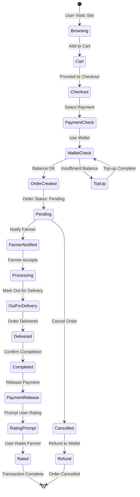

# HarvestHub System Architecture - Chart Data

## 1. HIGH-LEVEL SYSTEM LAYERS


### Layer Details for Chart

| Layer | Components | Purpose |
|-------|-----------|---------|
| **Client Layer** | Web Browser, Mobile Browser, Tablet Browser | User interface access points |
| **Presentation Layer** | Next.js 15, React 19, Tailwind CSS | UI rendering and routing |
| **Business Logic Layer** | AI Forecasting, Order Management, COD Payment | Core application logic |
| **Data Access Layer** | Firebase SDK | Database abstraction |
| **Backend Layer** | Firebase Auth, Firestore, Storage | Cloud services |
| **External Services** | OpenStreetMap, DA API | Third-party integrations |

---

## 2. SYSTEM ARCHITECTURE - DETAILED FLOW (Client-Server-Database)

### 🏗️ Complete Architecture with Labeled Components


### 📋 Architecture Layer Breakdown

#### 🖥️ Layer 1: CLIENT LAYER
**Purpose:** User interaction endpoints  
**Technology:** Modern web browsers  
**Communication:** HTTPS (Port 443)  
**Devices Supported:**
- Desktop browsers (Chrome 90+, Firefox 88+, Safari 14+)
- Mobile browsers (iOS Safari, Chrome Mobile)
- Tablet browsers (iPad, Android tablets)

**Features:**
- Responsive design (mobile-first)
- Progressive Web App (PWA) ready
- Offline capability (future)

---

#### ⚛️ Layer 2: PRESENTATION LAYER
**Purpose:** UI rendering and client-side logic  
**Framework:** Next.js 15.5.4 + React 19.1.0  
**Port:** 3000 (development), 443 (production)  

**Components:**
1. **Next.js Application**
   - Server-Side Rendering (SSR)
   - Static Site Generation (SSG)
   - API Routes (optional)
   - Image optimization

2. **App Router**
   - File-based routing (`app/` directory)
   - Dynamic routes (`[id]`)
   - Route groups (`(auth)`)
   - Layouts and templates

3. **React Components**
   - Functional components
   - Component composition
   - Props and children
   - Reusable UI elements

4. **React Hooks**
   - `useState` - State management
   - `useEffect` - Side effects, data fetching
   - `useRef` - DOM references, map instances
   - `useRouter` - Navigation
   - `useAuth` - Custom auth hook

5. **Utility Functions**
   - `dateUtils.ts` - Date formatting
   - `marketData.ts` - Price data processing
   - `utils.ts` - General helpers

---

#### 🧠 Layer 3: BUSINESS LOGIC LAYER
**Purpose:** Core application features  
**Pattern:** Service-oriented architecture  

**Services:**

1. **AI Price Forecasting**
   - Input: Historical price data (30 days)
   - Processing: Time-series analysis, trend detection
   - Output: 7-30 day price predictions with confidence scores
   - Algorithm: Moving averages + seasonal patterns

2. **Order Management**
   - Create orders (validate stock, calculate total)
   - Update order status (pending → delivery → completed)
   - Cancel orders (refund processing)
   - Order history and filtering

3. **COD Payment Processing**
   - Cash on Delivery method selection
   - Payment amount display
   - Payment reminders for buyers
   - Cash collection tracking for farmers
   - Order completion confirmation

4. **Rating System**
   - Submit ratings (1-5 stars + comment)
   - Calculate average ratings
   - Display rating distribution
   - Prevent duplicate ratings

5. **Location Services**
   - Get user location (browser geolocation)
   - Find nearby farmers (radius search)
   - Calculate distances (Haversine formula)
   - Geocoding and reverse geocoding

6. **Market Analytics**
   - Price trend analysis
   - Supply/demand metrics
   - Seasonal insights
   - Competitive pricing

---

#### 📡 Layer 4: DATA ACCESS LAYER
**Purpose:** Abstract database operations  
**Technology:** Firebase JavaScript SDK v10.x  

**Services:**

1. **Firebase SDK**
   - Initialized with project config
   - Singleton pattern
   - Error handling
   - Retry logic

2. **Authentication Service**
   - `signInWithEmailAndPassword()`
   - `createUserWithEmailAndPassword()`
   - `signOut()`
   - `onAuthStateChanged()` - Real-time auth state
   - `updateProfile()`

3. **Firestore Service**
   - `collection()` - Get collection reference
   - `doc()` - Get document reference
   - `getDoc()` - Read single document
   - `getDocs()` - Read multiple documents
   - `setDoc()` - Create/overwrite document
   - `updateDoc()` - Update specific fields
   - `deleteDoc()` - Delete document
   - `query()` + `where()` - Filtered queries
   - `orderBy()` + `limit()` - Sorting and pagination
   - `onSnapshot()` - Real-time listeners (optional)

4. **Storage Service**
   - `ref()` - Get storage reference
   - `uploadBytes()` - Upload file
   - `uploadString()` - Upload base64
   - `getDownloadURL()` - Get public URL
   - `deleteObject()` - Delete file

---

#### ☁️ Layer 5: BACKEND LAYER
**Purpose:** Serverless backend infrastructure  
**Provider:** Firebase (Google Cloud Platform)  
**Architecture:** Backend as a Service (BaaS)  

**Services:**

1. **Firebase Authentication**
   - Protocol: REST API over HTTPS
   - Token: JWT (JSON Web Tokens)
   - Session: 1 hour default, auto-refresh
   - Features:
     - Email/password authentication
     - Custom claims (role-based)
     - Email verification
     - Password reset

2. **Cloud Firestore**
   - Type: NoSQL document database
   - Protocol: gRPC over HTTPS
   - Structure: Collections → Documents → Fields
   - Collections: 6 (users, products, orders, ratings, community_posts, community_comments)
   - Estimated docs: ~10,000
   - Features:
     - Real-time synchronization
     - Offline persistence
     - Automatic scaling
     - Multi-region replication

3. **Firebase Storage**
   - Type: Blob storage (Google Cloud Storage)
   - Protocol: REST API over HTTPS
   - Buckets: 1 (default bucket)
   - Contents: Product images, profile photos
   - Features:
     - Automatic CDN distribution
     - Resumable uploads
     - Image transformation (future)

4. **Security Rules**
   - File: `firestore.rules`, `storage.rules`
   - Language: Rules DSL (Domain Specific Language)
   - Deployment: `firebase deploy --only firestore:rules`
   - RBAC: 3 roles (admin, farmer, user)
   - Functions:
     - `isAuthenticated()` - Check auth status
     - `isAdmin()` - Check admin role
     - `isOwner()` - Check document ownership

**Firestore Security Rules Example:**
```javascript
// users collection
allow read: if isAuthenticated();
allow write: if isAdmin() || isOwner(userId);

// products collection
allow read: if isAuthenticated();
allow write: if isOwner(farmerId) || isAdmin();

// orders collection
allow read: if isOwner(buyerId) || isOwner(farmerId) || isAdmin();
allow write: if isOwner(buyerId) || isOwner(farmerId) || isAdmin();
```

---

#### 🌐 Layer 6: EXTERNAL SERVICES
**Purpose:** Third-party integrations  

**Services:**

1. **OpenStreetMap (via Leaflet.js)**
   - Type: Map tile provider
   - Protocol: HTTPS
   - API: Leaflet.js 1.9.4
   - Tile URL: `https://{s}.tile.openstreetmap.org/{z}/{x}/{y}.png`
   - Attribution: Required (open-source)
   - Features:
     - Interactive maps
     - Custom markers
     - Popups and tooltips
     - Geolocation support

2. **DA Philippines API**
   - Type: Agricultural price data
   - Protocol: HTTPS REST API
   - Endpoint: `https://api.da.gov.ph/prices` (example)
   - Data: Daily commodity prices
   - Update frequency: Daily
   - Features:
     - Historical price data
     - Regional price variations
     - Commodity categorization

3. **Payment Gateway (Future)**
   - Providers: GCash, PayPal
   - Protocol: HTTPS REST API + Webhooks
   - Features:
     - Payment processing
     - Refund handling
     - Transaction verification
     - Webhook notifications

---

### 🔄 Data Flow Example: User Places Order

**Step-by-step flow through all layers:**

```
1. CLIENT LAYER
   User clicks "Add to Cart" button in web browser

2. PRESENTATION LAYER
   → React component captures click event
   → useState updates cart state
   → User clicks "Checkout"
   → Next.js router navigates to /checkout

3. BUSINESS LOGIC LAYER
   → Order Management service validates:
     - Product availability
     - Delivery address
   → COD Payment Processing calculates total amount
   → Payment method set to "Cash on Delivery"

4. DATA ACCESS LAYER
   → Firebase SDK prepares Firestore transaction:
     - Create order document (paymentMethod: COD)
     - Update product stock
     - Record order timestamp

5. BACKEND LAYER
   → Firestore Security Rules validate:
     - User is authenticated ✓
     - User is the order creator ✓
   → Firestore commits transaction
   → Order document created with ID: "order_12345"

6. PRESENTATION LAYER (Return)
   → SDK returns order object
   → UI updates: "Order placed successfully!"
   → useEffect triggers order confirmation page

7. CLIENT LAYER (Result)
   → Browser displays order confirmation
   → User sees order ID and estimated delivery
```

---

### 🔐 Security Flow

**Authentication & Authorization at Each Layer:**

```
CLIENT → PRESENTATION → BUSINESS LOGIC → DATA ACCESS → BACKEND
  ↓           ↓              ↓               ↓            ↓
Check       Check          Check           Check       Enforce
session     auth state     permissions     token       rules
cookie      context        by role         validity    by role
```

**Example: Farmer Updates Product Price**

```
1. CLIENT: Logged in farmer user
2. PRESENTATION: Check if user.role === "farmer"
3. BUSINESS LOGIC: Validate new price (positive number)
4. DATA ACCESS: Include JWT token in request headers
5. BACKEND: Firestore rules check:
   - isAuthenticated() ✓
   - isOwner(farmerId) ✓ (product.farmerId === auth.uid)
   → Allow update ✓
```

---

### 📊 Performance Metrics by Layer

| Layer | Response Time | Bottleneck | Optimization |
|-------|--------------|------------|--------------|
| **Client** | 0ms | Network latency | CDN, caching |
| **Presentation** | 50-100ms | Bundle size | Code splitting |
| **Business Logic** | 10-50ms | Complex calculations | Memoization |
| **Data Access** | 20-100ms | SDK overhead | Connection pooling |
| **Backend** | 100-500ms | Database queries | Indexes, denormalization |
| **External** | 200-2000ms | Third-party APIs | Caching, fallbacks |
| **Total** | ~400ms-3s | Depends on operation | End-to-end optimization |

---

## 3. DATABASE SCHEMA - COLLECTIONS

### 📊 Entity Relationship Diagram (ERD) with Complete Relationships

```mermaid
erDiagram
    USERS ||--o{ PRODUCTS : "creates (farmerId)"
    USERS ||--o{ ORDERS : "places as buyer (buyerId)"
    USERS ||--o{ ORDERS : "receives as farmer (farmerId)"
    USERS ||--o{ RATINGS : "gives as rater (userId)"
    USERS ||--o{ RATINGS : "receives as farmer (farmerId)"
    USERS ||--o{ COMMUNITY_POSTS : "authors (authorId)"
    USERS ||--o{ COMMUNITY_COMMENTS : "writes (authorId)"
    PRODUCTS ||--o{ ORDERS : "included in (productId)"
    ORDERS ||--o{ RATINGS : "generates after completion (orderId)"
    COMMUNITY_POSTS ||--o{ COMMUNITY_COMMENTS : "contains (postId)"

    USERS {
        string userId PK "Primary Key - Auto-generated"
        string email UNIQUE "User email address"
        string name "Full name"
        string role "admin/farmer/user"
        string contact "Phone number"
        string profilePhoto "Base64 or Storage URL"
        object location "lat, lng, address"
        timestamp createdAt "Account creation date"
        timestamp updatedAt "Last modification date"
    }

    PRODUCTS {
        string productId PK "Primary Key - Auto-generated"
        string farmerId FK "Foreign Key -> USERS.userId"
        string name "Product name"
        string description "Product description"
        number price "Price per unit (₱)"
        number quantity "Available stock"
        string category "vegetable/fruit/grain/etc"
        string unit "kg/pcs/sack"
        array images "Array of base64/URLs"
        timestamp harvestDate "Harvest date"
        timestamp createdAt "Product listing date"
        timestamp updatedAt "Last update"
    }

    ORDERS {
        string orderId PK "Primary Key - Auto-generated"
        string buyerId FK "Foreign Key -> USERS.userId"
        string farmerId FK "Foreign Key -> USERS.userId"
        string productId FK "Foreign Key -> PRODUCTS.productId"
        string productName "Snapshot of product name"
        string productImage "Snapshot of product image"
        number quantity "Ordered quantity"
        number price "Price at order time"
        number totalAmount "quantity * price"
        string status "pending/out-for-delivery/completed/cancelled"
        string paymentMethod "Cash on Delivery (COD)"
        string deliveryMethod "pickup/delivery"
        string deliveryAddress "Full delivery address"
        string buyerEmail "Snapshot of buyer email"
        boolean reviewed "Has user rated?"
        timestamp createdAt "Order placement date"
        timestamp updatedAt "Last status update"
    }

    RATINGS {
        string ratingId PK "Primary Key - Auto-generated"
        string farmerId FK "Foreign Key -> USERS.userId (farmer)"
        string userId FK "Foreign Key -> USERS.userId (rater)"
        string orderId FK "Foreign Key -> ORDERS.orderId"
        number rating "1-5 stars"
        string comment "Review text"
        timestamp createdAt "Rating submission date"
    }

    COMMUNITY_POSTS {
        string postId PK "Primary Key - Auto-generated"
        string authorId FK "Foreign Key -> USERS.userId"
        string authorName "Snapshot of author name"
        string content "Post content/text"
        array images "Array of image URLs"
        number likes "Like count"
        array likedBy "Array of userIds who liked"
        number commentCount "Number of comments"
        timestamp createdAt "Post creation date"
    }

    COMMUNITY_COMMENTS {
        string commentId PK "Primary Key - Auto-generated"
        string postId FK "Foreign Key -> COMMUNITY_POSTS.postId"
        string authorId FK "Foreign Key -> USERS.userId"
        string authorName "Snapshot of author name"
        string content "Comment text"
        timestamp createdAt "Comment date"
    }
```

### 🔑 Key Definitions

**Primary Keys (PK)**
- Unique identifier for each document
- Auto-generated by Firestore
- Immutable once created

**Foreign Keys (FK)**
- Reference to another collection's primary key
- Establishes relationships between collections
- Enables data denormalization for performance

**Indexes**
- Composite indexes created for complex queries
- Single-field indexes auto-created by Firestore
- Custom indexes defined in `firestore.indexes.json`

### 🔗 Relationship Cardinality Legend

| Symbol | Meaning | Example |
|--------|---------|---------|
| `||--o{` | One to Many | One USER creates many PRODUCTS |
| `o{--o{` | Many to Many | Not used (requires junction table) |

### 📈 Collection Relationships Explained

1. **USERS → PRODUCTS** (One-to-Many)
   - One farmer can create multiple products
   - FK: `products.farmerId` → `users.userId`
   - Query: "Get all products by farmer X"

2. **USERS → ORDERS** (One-to-Many, Dual)
   - One user can place multiple orders (as buyer)
   - One farmer can receive multiple orders (as seller)
   - FK: `orders.buyerId` → `users.userId`
   - FK: `orders.farmerId` → `users.userId`
   - Query: "Get all orders for user X (as buyer or seller)"

3. **USERS → RATINGS** (One-to-Many, Dual)
   - One user can give multiple ratings
   - One farmer can receive multiple ratings
   - FK: `ratings.userId` → `users.userId` (rater)
   - FK: `ratings.farmerId` → `users.userId` (rated farmer)
   - Query: "Get all ratings by user X" or "Get all ratings for farmer Y"

4. **PRODUCTS → ORDERS** (One-to-Many)
   - One product can be in multiple orders
   - FK: `orders.productId` → `products.productId`
   - Query: "Get all orders for product X"

5. **ORDERS → RATINGS** (One-to-One)
   - Each completed order can have one rating
   - FK: `ratings.orderId` → `orders.orderId`
   - Query: "Get rating for order X"

6. **USERS → COMMUNITY_POSTS** (One-to-Many)
   - One user can create multiple posts
   - FK: `community_posts.authorId` → `users.userId`
   - Query: "Get all posts by user X"

7. **COMMUNITY_POSTS → COMMUNITY_COMMENTS** (One-to-Many)
    - One post can have multiple comments
    - FK: `community_comments.postId` → `community_posts.postId`
    - Query: "Get all comments for post X"

### 🗃️ NoSQL Data Denormalization Strategy

**Why Denormalize?**
- Reduce read operations (Firestore charges per document read)
- Improve query performance
- Minimize client-side joins

**Denormalized Fields Examples:**

| Collection | Denormalized Field | Source | Reason |
|------------|-------------------|--------|---------|
| ORDERS | `productName` | PRODUCTS.name | Avoid product lookup on order display |
| ORDERS | `productImage` | PRODUCTS.images[0] | Show order image without product fetch |
| ORDERS | `buyerEmail` | USERS.email | Email notification without user fetch |
| COMMUNITY_POSTS | `authorName` | USERS.name | Display author without user fetch |
| COMMUNITY_COMMENTS | `authorName` | USERS.name | Display commenter without user fetch |

**Trade-offs:**
- ✅ Faster reads, fewer queries
- ❌ Data duplication, potential inconsistency
- ⚠️ Need update logic when source changes

---

## 4. USER ROLES & PERMISSIONS


### Permissions Matrix

| Feature | Admin | Farmer | User |
|---------|-------|--------|------|
| View All Users | ✅ | ❌ | ❌ |
| Promote/Demote Users | ✅ | ❌ | ❌ |
| Create Products | ✅ | ✅ | ❌ |
| Edit Own Products | ✅ | ✅ | ❌ |
| View All Products | ✅ | ✅ | ✅ |
| Place Orders (COD) | ✅ | ❌ | ✅ |
| Manage Orders (Seller) | ✅ | ✅ | ❌ |
| View Own Orders | ✅ | ✅ | ✅ |
| Rate Farmers | ✅ | ❌ | ✅ |
| Set Location | ✅ | ✅ | ✅ |
| Community Posts | ✅ | ✅ | ✅ |

---

## 5. USER JOURNEY FLOWS

### A. User Purchase Flow


### B. Farmer Product Management Flow


### C. Admin User Management Flow


---

## 6. AUTHENTICATION & SECURITY FLOW


### Security Rules Structure


---

## 7. AI PRICE FORECASTING SYSTEM


### AI Components

| Component | Function | Input | Output |
|-----------|----------|-------|--------|
| **Data Fetcher** | Retrieve price data | Product category | 30-day price history |
| **Trend Analyzer** | Detect price trends | Historical prices | Trend direction |
| **Seasonal Detector** | Find patterns | Time series data | Seasonal factors |
| **Volatility Calculator** | Measure stability | Price fluctuations | Risk score |
| **Forecaster** | Predict prices | All above | 7-30 day predictions |
| **Confidence Calculator** | Reliability score | Forecast + volatility | 0-100% confidence |

---

## 8. GEOSPATIAL MAPPING SYSTEM


### Map Components

| Component | Technology | Purpose |
|-----------|-----------|---------|
| **Map Library** | Leaflet.js 1.9.4 | Core mapping functionality |
| **Map Tiles** | OpenStreetMap | Base map imagery |
| **Markers** | Leaflet Markers | Location pins |
| **Popups** | Leaflet Popups | Information display |
| **Geolocation** | Browser API | User location |
| **Distance Calc** | Haversine Formula | Calculate distance |

---

## 9. DIGITAL WALLET SYSTEM


### Wallet Transaction Types

| Type | Source | Destination | Trigger |
|------|--------|-------------|---------|
| **Credit** | Payment Gateway | User Wallet | Top-up |
| **Debit** | User Wallet | Farmer Pending | Purchase |
| **Transfer** | Farmer Pending | Farmer Balance | Order Complete |
| **Withdrawal** | Farmer Balance | Bank Account | Withdrawal Request |
| **Refund** | Farmer Pending | User Wallet | Order Cancelled |

---

## 10. TECHNOLOGY STACK HIERARCHY


---

## 11. DEPLOYMENT ARCHITECTURE


### Deployment Environments

| Environment | Branch | Auto-Deploy | URL |
|-------------|--------|-------------|-----|
| **Development** | feature/* | ❌ | localhost:3000 |
| **Staging** | develop | ✅ | staging-harvest-hub.vercel.app |
| **Production** | main | ✅ | harvest-hub.vercel.app |

---

## 12. DATA FLOW - ORDER LIFECYCLE



---

## 13. COMPONENT ARCHITECTURE


---

## 14. SYSTEM METRICS & MONITORING

### Performance Metrics

| Metric | Target | Tool |
|--------|--------|------|
| **Page Load Time** | < 2s | Vercel Analytics |
| **First Contentful Paint** | < 1.5s | Lighthouse |
| **Time to Interactive** | < 3s | Lighthouse |
| **API Response Time** | < 500ms | Firebase Console |
| **Error Rate** | < 1% | Firebase Crashlytics |
| **Uptime** | 99.9% | Vercel Status |

### Database Metrics

| Collection | Avg Doc Size | Read/Write Ratio | Index Count |
|------------|--------------|------------------|-------------|
| **users** | 2 KB | 80/20 | 3 |
| **products** | 5 KB | 90/10 | 5 |
| **orders** | 3 KB | 60/40 | 7 |
| **wallets** | 1 KB | 70/30 | 2 |
| **transactions** | 1 KB | 95/5 | 4 |
| **ratings** | 2 KB | 85/15 | 3 |

---

## CHART GENERATION TOOLS

### Recommended Tools for Visualization

1. **Mermaid Live Editor**: https://mermaid.live
   - All diagrams above are in Mermaid syntax
   - Copy-paste directly into editor

2. **Draw.io / diagrams.net**: https://app.diagrams.net
   - Import Mermaid or create from scratch

3. **Lucidchart**: https://lucid.app
   - Professional diagrams
   - Team collaboration

4. **PlantUML**: https://plantuml.com
   - Alternative syntax
   - Good for sequence diagrams

5. **Figma**: https://figma.com
   - Design system architecture
   - UI/UX flow diagrams

---

**Export Formats Available:**
- SVG (scalable)
- PNG (images)
- PDF (documents)
- JSON (data)

**Last Updated**: November 16, 2025
