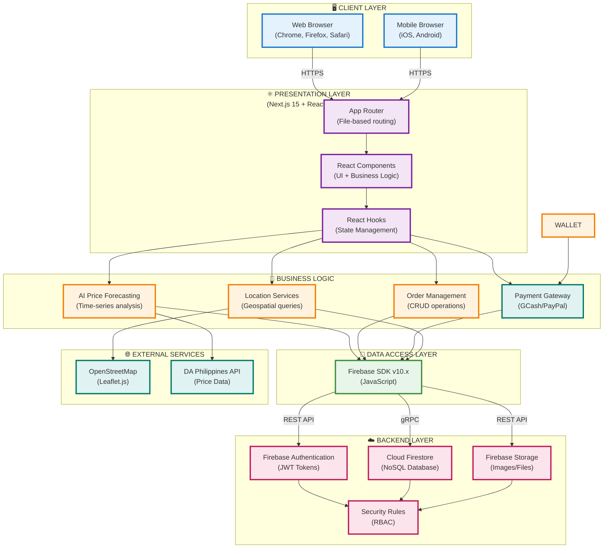

# HarvestHub System Demonstration Guide
## Complete Workflow from Start to End

**Date:** November 16, 2025  
**Version:** 1.0.0  
**Platform:** Web Application (Next.js + Firebase)

---

## System Architecture Diagrams

### 1. System Architecture: Client-Server-Database Flow



**Architecture Flow Explanation:**

1. **Client Layer** → Users access via web/mobile browsers using HTTPS
2. **Presentation Layer** → Next.js handles routing, React renders UI components
3. **Business Logic** → Core features process data and implement workflows
4. **Data Access Layer** → Firebase SDK abstracts database operations
5. **Backend Layer** → Firebase services store data and enforce security
6. **External Services** → Third-party APIs provide maps, prices, payments

---

### 2. Database Schema: NoSQL Structure with Relationships

```mermaid
erDiagram
    USERS ||--o{ PRODUCTS : "creates (farmerId)"
    USERS ||--o{ ORDERS : "places as buyer (buyerId)"
    USERS ||--o{ ORDERS : "receives as farmer (farmerId)"
    USERS ||--o{ RATINGS : "gives (userId)"
    USERS ||--o{ RATINGS : "receives as farmer (farmerId)"
    USERS ||--o{ COMMUNITY_POSTS : "authors (authorId)"
    USERS ||--o{ COMMUNITY_COMMENTS : "writes (authorId)"
    PRODUCTS ||--o{ ORDERS : "included in (productId)"
    ORDERS ||--o{ RATINGS : "generates (orderId)"
    COMMUNITY_POSTS ||--o{ COMMUNITY_COMMENTS : "contains (postId)"

    USERS {
        string userId PK "Auto-generated by Firebase"
        string email UNIQUE "User email address"
        string name "Full name or farm name"
        string role "admin/farmer/user"
        string contact "Phone number"
        string profilePhoto "Base64 or URL"
        object location "lat, lng, address"
        timestamp createdAt "Account creation"
        timestamp updatedAt "Last modification"
    }

    PRODUCTS {
        string productId PK "Auto-generated"
        string farmerId FK "→ USERS.userId"
        string name "Product name"
        string description "Product details"
        number price "Price per unit (₱)"
        number stock "Available quantity"
        string category "Type of product"
        string unit "kg/pcs/sack"
        array images "Base64 encoded images"
        timestamp harvestDate "Harvest date"
        timestamp createdAt "Listing date"
    }

    ORDERS {
        string orderId PK "Auto-generated"
        string buyerId FK "→ USERS.userId (buyer)"
        string farmerId FK "→ USERS.userId (farmer)"
        string productId FK "→ PRODUCTS.productId"
        string productName "Snapshot at order time"
        string productImage "Snapshot image"
        number quantity "Ordered amount"
        number price "Price at order time"
        number totalAmount "quantity × price"
        string status "pending/out-for-delivery/completed/cancelled"
        string paymentMethod "Cash on Delivery (COD)"
        string deliveryMethod "pickup/delivery"
        string deliveryAddress "Full address"
        string buyerEmail "Contact info"
        boolean reviewed "Has rating"
        timestamp createdAt "Order placed"
        timestamp updatedAt "Last status change"
    }

    RATINGS {
        string ratingId PK "Auto-generated"
        string farmerId FK "→ USERS.userId (rated farmer)"
        string userId FK "→ USERS.userId (rater)"
        string orderId FK "→ ORDERS.orderId"
        number rating "1-5 stars"
        string comment "Review text"
        timestamp createdAt "Rating date"
    }

    COMMUNITY_POSTS {
        string postId PK "Auto-generated"
        string authorId FK "→ USERS.userId"
        string authorName "Snapshot of name"
        string title "Post title"
        string content "Post content"
        string category "tip/success-story/question/discussion"
        array tags "Hashtags"
        number likes "Like count"
        array likedBy "User IDs who liked"
        number comments "Comment count"
        timestamp createdAt "Post date"
    }

    COMMUNITY_COMMENTS {
        string commentId PK "Auto-generated"
        string postId FK "→ COMMUNITY_POSTS.postId"
        string authorId FK "→ USERS.userId"
        string authorName "Snapshot of name"
        string content "Comment text"
        timestamp createdAt "Comment date"
    }
```

**Key Definitions:**

- **PK (Primary Key)**: Unique identifier auto-generated by Firestore
- **FK (Foreign Key)**: Reference to another collection's primary key
- **UNIQUE**: Field value must be unique across all documents
- **Optional (OPT)**: Field may be null/empty for some documents

**Relationship Types:**

- `||--o{` One-to-Many: One user creates many products
- `||--||` One-to-One: One user owns one wallet
- Dual references: Orders link both buyer and farmer

**Data Denormalization Strategy:**

To optimize read performance and reduce database queries, some data is intentionally duplicated:

| Collection | Denormalized Field | Source | Reason |
|------------|-------------------|--------|---------|
| ORDERS | productName | PRODUCTS.name | Show orders without product lookup |
| ORDERS | productImage | PRODUCTS.images[0] | Display order thumbnails |
| ORDERS | buyerEmail | USERS.email | Contact buyer without user lookup |
| COMMUNITY_POSTS | authorName | USERS.name | Display author without user fetch |
| COMMUNITY_COMMENTS | authorName | USERS.name | Show commenter name instantly |

**Index Strategy:**

Firestore automatically creates single-field indexes. Composite indexes defined in `firestore.indexes.json`:

- `products`: (farmerId, createdAt)
- `orders`: (buyerId, status, createdAt)
- `orders`: (farmerId, status, createdAt)
- `ratings`: (farmerId, createdAt)
- `community_posts`: (category, createdAt)
- `community_comments`: (postId, createdAt)

---

## System Overview Statement

HarvestHub is a comprehensive agricultural marketplace platform that connects farmers directly with buyers through a digital ecosystem featuring real-time product listings, AI-powered price forecasting, geospatial farmer discovery, Cash on Delivery (COD) payment system, and community knowledge sharing, all managed through role-based dashboards with complete order tracking from product listing to delivery and rating.

---

## Complete System Workflow

### 1. USER REGISTRATION & AUTHENTICATION

**The system begins when a new user visits the HarvestHub platform and clicks on the "Sign Up" button.** The user is presented with two registration options: signing up as a regular buyer or as a farmer. The user enters their email address, creates a secure password, provides their full name and contact information, and submits the registration form. The Firebase Authentication service validates the email format, checks for duplicate accounts, creates a secure user account with encrypted password storage, and generates a unique user ID. The system then creates a user document in the Firestore "users" collection with the role set to either "user" or "farmer", stores the profile information including email, name, contact details, and creation timestamp. Upon successful registration, the user receives a confirmation message and is automatically logged into the system, where Firebase generates a JWT (JSON Web Token) that is stored in the browser's secure storage for maintaining the authenticated session across page navigations.

**For farmer registration specifically**, the system prompts for additional business information including farm name, primary products, and an optional farm description. The farmer's role is set to "farmer" in the database, which grants access to the farmer-specific dashboard features including product management, order fulfillment, pricing analytics, and wallet management. The system initializes the farmer's profile with default location coordinates (which can be updated later in the profile settings) and sets up the framework for product listings and customer ratings.

---

### 2. FARMER PRODUCT LISTING PROCESS

**Once a farmer logs into their dashboard**, they are greeted with a personalized welcome message displaying their profile photo and name. The main dashboard shows an overview of their current products and provides a comprehensive form for adding new products. The farmer clicks on "Add New Product" and begins filling out the product details, starting with the product name (for example, "Organic Tomatoes"), selecting a category from predefined options (vegetables, fruits, grains, herbs, dairy, meat, or other), and writing a detailed description of the product including its characteristics, growing methods, and quality attributes.

**The farmer then sets the pricing and inventory information** by entering the price per unit in Philippine pesos, specifying the available quantity or stock level, selecting the unit of measurement (kilograms, pieces, sacks, bundles), and choosing the harvest date from a calendar picker to inform buyers about product freshness. This information is crucial for buyers to make informed purchasing decisions and for the system's inventory management.

**For product images**, the farmer has multiple upload options including dragging and dropping image files directly onto the upload area, clicking to browse and select images from their computer, or using the built-in camera feature to capture photos directly. The system supports up to 5 images per product to showcase different angles and qualities. When images are uploaded, the system automatically processes them through an aggressive compression algorithm that analyzes the original file size and applies appropriate compression levels: files over 5MB are compressed to 300px maximum dimension with 30% quality, files between 2-5MB are reduced to 350px with 40% quality, files between 1-2MB are compressed to 400px with 50% quality, and smaller files receive lighter compression to maintain quality while ensuring database storage efficiency. The compressed images are converted to base64 format and stored directly in the Firestore database, eliminating the need for separate storage bucket management and ensuring faster load times for product displays.

**After completing all fields**, the farmer reviews the product information for accuracy and clicks the "Add Product" button. The system validates that all required fields are filled, processes and compresses the uploaded images (with a progress indicator showing "Compressing image 1 of 5..."), converts images to base64 encoding for database storage, and creates a new document in the Firestore "products" collection with all product details including name, description, category, price, stock quantity, harvest date, compressed images array, farmer ID reference, farmer name, and creation timestamp. The system then displays a success message confirming "Product added successfully!" and automatically refreshes the product list to show the newly added item in the farmer's dashboard product grid.

---

### 3. AI-POWERED PRICE FORECASTING

**When a farmer navigates to the "Market Pricing" page**, the system immediately initiates a comprehensive market analysis process. The page displays a clean interface with the farmer's current products listed on the left side and market intelligence data on the right. The system automatically fetches historical price data from the Department of Agriculture (DA) Philippines API, retrieving the past 30 days of commodity prices for relevant agricultural products in the farmer's region.

**The AI forecasting engine processes this data** by performing time-series analysis to identify price trends (upward, downward, or stable patterns), detecting seasonal patterns that affect agricultural commodity prices throughout the year, calculating market volatility to assess price stability and risk factors, and analyzing supply and demand indicators from recent trading data. The algorithm applies moving averages to smooth out short-term fluctuations and reveal underlying trends, incorporates regional price variations to provide location-specific forecasts, and factors in historical seasonal patterns for crops with predictable cycles.

**The system generates forecasts for three time horizons**: 7-day predictions showing immediate short-term price movements useful for quick selling decisions, 14-day predictions providing medium-term outlook for harvest planning, and 30-day predictions offering long-term strategic guidance for planting and inventory decisions. Each forecast includes a confidence score calculated based on data quality, historical accuracy, market volatility, and the consistency of recent price patterns. The confidence scores are displayed as percentages (ranging from 0-100%) with color coding: green for high confidence (above 80%), yellow for moderate confidence (60-80%), and orange for lower confidence (below 60%).

**The market pricing page displays this information** in an intuitive visual format with line graphs showing historical prices and projected trends, color-coded forecast indicators (green arrows for predicted price increases, red arrows for decreases, and yellow for stable prices), numerical price ranges with minimum, maximum, and most likely values, and actionable insights such as "Good time to sell" or "Consider holding for better prices." The page automatically refreshes every 5 minutes to ensure data remains current, and farmers can manually trigger an immediate refresh by clicking the refresh button that displays a spinning icon animation during data fetching.

---

### 4. BUYER PRODUCT DISCOVERY

**When a buyer logs into the HarvestHub platform**, they land on the user dashboard which immediately displays a grid of available products from all registered farmers. The main page features a prominent search bar at the top where buyers can enter keywords to find specific products, a category filter dropdown allowing selection by product type (vegetables, fruits, grains, herbs, dairy, meat), and a sorting mechanism to arrange products by price (low to high or high to low), distance from buyer's location, newest listings first, or highest-rated farmers.

**Each product card in the grid displays** a high-quality compressed product image (the first image from the farmer's uploaded photos), the product name in bold text, a brief description truncated to two lines with an ellipsis, the price prominently shown in green text with the peso symbol (₱), the available stock quantity, the farmer's name as a clickable link, the farmer's average rating displayed as stars with the total number of ratings, the harvest date to indicate freshness, and the product category badge in a colored pill format. Products from highly-rated farmers are automatically prioritized in the default view to ensure quality products are prominently featured.

**When a buyer clicks on any product card**, a detailed product dialog opens as an overlay modal showing all five product images (if available) in a carousel format that users can scroll through, the complete untruncated product description with all details about growing methods and quality, full pricing information including price per unit and total stock available, the farmer's complete profile with photo, name, location, overall rating, and number of reviews, a distance indicator showing how far the farm is from the buyer's location (calculated using geospatial coordinates), an "Add to Cart" button prominently displayed in green, and a "View Farmer Profile" link to see all products from this farmer and read detailed customer reviews.

---

### 5. SHOPPING CART & CHECKOUT

**When a buyer clicks "Add to Cart"**, the system creates or updates a cart entry in the browser's local state (not stored in the database until checkout to prevent abandoned cart clutter). The cart icon in the navigation bar updates to show the total number of items with a small badge displaying the count. Buyers can continue shopping and adding more products, with each addition showing a brief success notification ("Added to cart!") that disappears after 2 seconds.

**Upon clicking the cart icon**, the buyer is taken to the cart page which displays a summary of all selected items in a clean table format. Each cart row shows the product thumbnail image, product name and farmer name, unit price, a quantity selector (plus and minus buttons to adjust the order amount, with real-time validation against available stock), subtotal calculation (quantity × price) that updates instantly when quantity changes, and a remove button (trash icon) to delete the item from cart. Below the cart items, the system displays the total item count, subtotal amount (sum of all item subtotals), an estimated delivery fee (calculated based on distance from farmer to buyer), applicable taxes or platform fees (if any), and the grand total amount prominently displayed in large green text.

**The buyer then clicks "Proceed to Checkout"** which triggers a navigation to the order summary page. This page requires the buyer to confirm their delivery information by selecting delivery method (pickup from farm or delivery to address), entering or confirming their delivery address (with auto-complete suggestions powered by geolocation API), providing delivery instructions or special requests in a text field, and selecting a preferred delivery date and time window. The system displays an estimated delivery time based on the farmer's location and the buyer's address, calculated using distance and average delivery speeds.

**Before placing the order**, the system performs critical validations including checking that all products still have sufficient stock (in case other buyers purchased the same items), ensuring delivery address is within the serviceable area (if delivery is selected), confirming all required fields are properly filled, and displaying the total amount to be paid in cash upon delivery. If any validation fails, the system displays specific error messages like "Sorry, Organic Tomatoes now has only 5 kg remaining. Please adjust your quantity" or "Please enter a valid delivery address."

---

### 6. CASH ON DELIVERY (COD) PAYMENT PROCESSING

**The HarvestHub platform uses Cash on Delivery (COD) as the payment method**, eliminating the need for online payment processing and wallet management. This approach is ideal for agricultural marketplaces where buyers prefer to pay in cash upon receiving their products, building trust through physical transactions and accommodating users who may not have digital payment options.

**When the buyer is ready to place an order**, they click "Place Order" on the checkout page after confirming their delivery details. The system displays a clear message: "Payment Method: Cash on Delivery (COD)" with an explanation that payment will be collected by the farmer upon delivery or at pickup. The buyer confirms they understand the COD terms including having exact change ready, payment due upon receipt of goods, and that orders may be cancelled if payment is not completed.

**The system then processes the order placement** by initiating a Firestore transaction (atomic operation) to ensure data consistency, which performs multiple database operations simultaneously: creating an order document in the "orders" collection with all order details (product IDs, quantities, prices, buyer and farmer IDs, delivery information, payment method set to "COD", and status set to "pending"), reducing the stock quantity for each ordered product in the "products" collection to prevent overselling, and recording the order timestamp for tracking purposes.

**If the transaction succeeds**, the system displays a confirmation page with the order number (generated unique ID), estimated delivery date, order summary with all items and total amount to be paid in cash, payment reminder ("Please prepare ₱[amount] in cash for delivery"), and buttons to "Track Order" or "Continue Shopping". The buyer receives an on-screen notification confirming the order placement with COD payment terms. The order document includes fields for order ID (unique identifier), buyer ID and email (for reference and notifications), farmer ID and name (for fulfillment tracking), product details including product ID, name, snapshot of price at time of order, and quantity purchased, total amount to be collected on delivery, payment method ("COD"), delivery method ("pickup" or "delivery"), full delivery address if applicable, order status (initially set to "pending"), creation timestamp for tracking order age, and a reviewed flag (initially false, set to true after buyer submits rating).

---

### 7. FARMER ORDER MANAGEMENT

**Simultaneously with order placement**, the farmer receives notification of the new order in their dashboard. When the farmer logs into their account and navigates to the "Orders" page, they see a comprehensive list of all orders with filtering options to view orders by status: pending orders (newly placed, awaiting farmer acceptance), out-for-delivery orders (currently being transported), completed orders (successfully delivered), and cancelled orders (if cancellation was necessary).

**Each order card displays** the order ID for reference, buyer's name and contact email for communication, buyer's profile photo (if available), order date and time of placement, product details including name, quantity ordered, and unit price, total order amount in bold, delivery method selected by buyer, full delivery address if delivery is required, current order status with color-coded badge (yellow for pending, blue for out-for-delivery, green for completed, red for cancelled), and action buttons appropriate for the current status.

**For pending orders**, the farmer sees an "Accept Order" button and a "View Details" button. Clicking "View Details" opens a modal showing complete order information including buyer contact details for coordination, itemized product list with quantities and prices, delivery instructions provided by the buyer, and order timeline. The farmer can communicate with the buyer if needed (through phone/email shown in the order details) to confirm availability, clarify delivery details, or negotiate pickup timing.

**When the farmer clicks "Accept Order"**, the system updates the order status to "processing" (indicating farmer acknowledgment) and displays a reminder: "COD Payment: Collect ₱[amount] in cash upon delivery". The farmer begins preparing the products for delivery. Once the products are packaged and ready for shipment or the delivery person picks up the order, the farmer clicks "Mark as Out for Delivery" which updates the order status to "out-for-delivery" in the Firestore database and sends a notification to the buyer informing them that their order is on the way with a reminder to prepare the payment amount in cash. The order tracking page on the buyer's dashboard updates to show the new status with an estimated delivery time range and payment reminder.

**After successful delivery and cash payment collection**, the farmer clicks "Mark as Completed" which performs several critical system updates: changing the order status to "completed" in the database, recording the completion timestamp, and triggering a rating prompt notification for the buyer to leave feedback about the transaction. The farmer keeps the cash payment received directly, with no digital transaction processing needed.

---

### 8. ORDER DELIVERY & COMPLETION

**From the buyer's perspective**, they can track their order status in real-time by navigating to "My Orders" in their user dashboard. The order tracking page displays a timeline visualization showing the order's journey through different stages: Order Placed (with timestamp), Order Accepted by Farmer (with farmer confirmation time), Out for Delivery (with shipment time), and Delivered/Completed (with completion time). Each stage is marked with an icon and color indicator (gray for future stages, green for completed stages, and blue for current stage).

**For pickup orders**, the buyer sees the farmer's location address with a "Get Directions" button that opens the location in the device's mapping application, the pickup time window agreed upon, contact information for the farmer to coordinate pickup, and a reminder to bring the order confirmation number. When the buyer arrives and collects their order, they can mark it as "Picked Up" which notifies the farmer to complete the order from their end.

**For delivery orders**, the system shows an estimated delivery time based on the distance and typical delivery speeds, the delivery address confirmation with an option to update if necessary, and real-time status updates as the farmer updates the order progress. Once the delivery is completed and the farmer marks the order as "Completed", the buyer receives a notification asking them to confirm receipt and rate the transaction.

---

### 9. RATING & REVIEW SYSTEM

**After order completion**, the buyer is prompted to rate their experience through a modal dialog or notification. The rating form appears in the user's dashboard under completed orders with a prominent "Rate this Order" button displayed in yellow or orange to draw attention. Clicking this button opens a rating interface where the buyer can select a star rating from 1 to 5 stars (with descriptive labels: 1 star = "Poor", 2 stars = "Fair", 3 stars = "Good", 4 stars = "Very Good", 5 stars = "Excellent"), write a detailed text review describing their experience with the product quality, delivery timeliness, farmer communication, and overall satisfaction, and submit the feedback.

**Upon submission**, the system creates a new document in the "ratings" collection containing the rating ID (unique identifier), farmer ID being rated, buyer/user ID who submitted the rating, order ID this rating is associated with, rating score (1-5), detailed comment/review text, and creation timestamp. The system updates the order document to mark reviewed flag as true (preventing duplicate ratings for the same order), recalculates the farmer's overall average rating by fetching all ratings for this farmer, summing the rating scores, dividing by the count to get the average, and updating the cached average rating in the farmer's profile for quick display, and updates the farmer's total review count for display on product listings and farmer profile.

**Farmers can view their ratings** on the dedicated "Ratings" page in their dashboard which displays overall statistics including average rating (e.g., 4.7 out of 5 stars) prominently shown at the top with large star icons, total number of reviews received, rating distribution showing how many 5-star, 4-star, 3-star, 2-star, and 1-star reviews as a bar chart, and percentage breakdown (e.g., "65% gave 5 stars"). Below the statistics, the page shows individual reviews in chronological order (newest first) with each review card containing the reviewer's name (or "Anonymous User" if privacy is preferred), review date, star rating with filled/unfilled star icons, full review text, and the associated product name and order details for context.

---

### 10. GEOSPATIAL FARMER DISCOVERY

**Users can discover nearby farmers** through the integrated "Farmer Map" feature accessible from the main navigation menu. When a user clicks on "Farmer Map", the system requests the user's current location using the browser's Geolocation API (with the user's permission through a browser prompt asking "Allow HarvestHub to access your location?"). Once permission is granted, the system retrieves the user's latitude and longitude coordinates and displays them on an interactive Leaflet.js map powered by OpenStreetMap tiles.

**The map interface displays** the user's location marked with a blue circular marker (representing "You are here"), farmer locations marked with green markers (representing farms with products), interactive zoom controls (plus and minus buttons) for zooming in and out, a "Set My Location" button to manually adjust the user's position if automatic detection is inaccurate, and a search radius slider to adjust the search distance from 1 km to 50 km. The map legend at the bottom explains the marker colors and includes a distance line showing the radius of the current search area.

**For each farmer marker on the map**, users can click to view a popup window showing the farmer's name as a clickable link, profile photo, average rating with star display, number of available products with a count badge, physical address of the farm, calculated distance from the user's current location using the Haversine formula (accounting for Earth's curvature), and a "View Products" button that filters the product listing page to show only products from this specific farmer.

**The nearby farmers sidebar** on the right side of the map displays a sortable list of farmers within the selected radius, automatically sorted by distance (closest first) by default but with options to sort by rating (highest first) or number of products (most first). Each farmer card in the sidebar shows the same information as the map popup plus a call-to-action button to visit the farmer's profile or browse their products. Clicking on a farmer in the sidebar automatically centers the map on that farmer's location and opens their info popup for a seamless integrated experience.

---

### 11. COMMUNITY HUB & KNOWLEDGE SHARING

**The Community Hub serves as a knowledge-sharing platform** where farmers can exchange tips, share success stories, ask questions, and engage in discussions about agricultural best practices. When users navigate to the Community Hub from the main menu, they see a feed of posts displayed in a card grid layout similar to social media platforms. The hub interface includes a search bar to find posts by keywords or hashtags, a category filter dropdown with options for "Tips & Best Practices", "Success Stories", "Questions", and "Discussions", and a prominent "New Post" button in bright green to encourage participation.

**Each post card in the feed displays** a colored category badge (blue for tips with a lightbulb icon 💡, green for success stories with a star icon 🌟, yellow for questions with a question mark icon ❓, purple for discussions with a chat icon 💬), the post title as a bold clickable headline, a preview of the post content (truncated to 3 lines with ellipsis), hashtags or tags associated with the post (e.g., #organic, #irrigation, #pestControl) displayed as clickable pills, the author's name and role (farmer or user), the post creation date in relative format (e.g., "2 days ago"), engagement metrics showing number of likes with a thumbs-up icon and number of comments, and hover effects that slightly elevate the card to indicate interactivity.

**When a user clicks on any post**, a detailed view modal opens displaying the full post with the complete title prominently shown, the author's profile photo and name, the full creation date and time, all associated hashtags as clickable filters, the complete untruncated post content (which can include multiple paragraphs, line breaks preserved), and engagement buttons including a "Like" button (with a count showing how many users liked this post and the icon changing color if the current user has already liked it) and a "Comment" section below the post content.

**The comments section** shows all comments in chronological order with each comment displaying the commenter's name, profile photo thumbnail, comment date, and comment text. A "Add Comment" text area at the bottom allows users to type their response and post it by clicking "Post Comment". When a new comment is submitted, the system creates a document in the "community_comments" collection with comment ID, reference to the parent post ID, commenter's user ID and name, comment content, and timestamp, and increments the comment count on the parent post document for accurate display in the feed.

**To create a new post**, users click the "New Post" button which opens a post creation modal with fields for post title (required text input for the headline), category selection (dropdown with the four category options), post content (large textarea supporting multi-line text with rich formatting preserved), and tags input (comma-separated text input where users can type tags like "organic, irrigation, pest-control"). After filling in all required fields, the user clicks "Post" which validates that title and content are not empty, creates a new document in the "community_posts" collection with all post details including author information (ID, name, role), initializes engagement metrics (likes: 0, comments: 0), and sets the creation timestamp. The modal closes and the new post immediately appears at the top of the community feed.

---

### 12. FARMER PROFILE MANAGEMENT

**Farmers can manage their profile** through the dedicated "Profile" page in their farmer dashboard. The profile page is divided into two main sections: personal information on the left and farm location settings on the right. The personal information section displays editable fields for farmer name (text input for full name or farm business name), contact number (phone input with format validation for Philippine numbers +63XXXXXXXXXX), profile photo upload (with options to upload a new image, take a photo using device camera, or remove current photo), and a bio or farm description textarea where farmers can describe their farming practices, specialties, and story.

**The location settings section** features an interactive map showing the farmer's current registered location with a draggable marker that farmers can reposition to accurately mark their farm's physical address. Below the map, the system displays the current coordinates (latitude and longitude) in decimal format, the reverse-geocoded address (street address, barangay, city, province) automatically fetched from the map coordinates using geocoding services, and a "Set My Location" button to use the device's GPS for automatic location detection if farmers are physically at their farm when updating the profile.

**When farmers make changes** to their profile information, they click "Save Changes" at the bottom of the form. The system validates all inputs (ensuring required fields like name and contact are filled, validating phone number format, checking that location coordinates are within valid ranges), compresses and converts any new profile photo to base64 if uploaded, and updates the farmer's document in the Firestore "users" collection with all modified fields including the updated timestamp. A success notification appears confirming "Profile updated successfully!" and the changes are immediately reflected throughout the system wherever the farmer's information appears (product listings, order details, community posts, ratings).

**The profile page also displays performance metrics** for the farmer including total products listed (count of active products in inventory), total orders received (lifetime order count), overall rating (average of all customer ratings with star display), total reviews (count of ratings received), join date (when the farmer account was created), and badges or achievements if the system implements gamification (e.g., "Top Rated Farmer", "Fast Delivery", "Organic Certified"). These metrics help farmers track their business performance and build credibility with potential buyers.

---

### 13. ADMIN USER MANAGEMENT

**System administrators have access to a special admin dashboard** accessible only to users with role "admin" in the database. The admin dashboard provides comprehensive oversight and management tools for the entire platform. When an admin logs in, they are directed to the admin-specific interface which includes sections for user management, system analytics, reported content moderation, and platform settings.

**The user management section** displays a searchable and filterable table of all registered users with columns showing user ID, email address, full name, current role (user, farmer, or admin), registration date, last login timestamp, account status (active, suspended, deleted), total orders (for users) or total products (for farmers), and action buttons for each user. The admin can search users by email or name, filter by role to view only farmers or only buyers, sort by registration date or activity level, and export the user list as a CSV file for analysis.

**For each user, the admin can perform management actions** including viewing full profile details by clicking a "View" button which opens a detailed user information modal, promoting regular users to farmer status by clicking "Promote to Farmer" which updates their role field in the database and grants access to farmer dashboard features, demoting farmers back to regular user status if they violate policies by clicking "Demote to User", promoting trusted users to admin status (with careful consideration) to help manage the platform, suspending accounts temporarily for policy violations which prevents login while preserving data, permanently deleting accounts and all associated data (with confirmation dialog to prevent accidents), and resetting passwords if users report access issues.

**When an admin promotes a user to farmer**, the system validates that the admin has proper permissions by checking isAdmin() in the security rules, updates the user's role field from "user" to "farmer" in the Firestore "users" collection, grants the user access to all farmer dashboard pages and features, initializes farmer-specific data structures if needed (such as location coordinates with default values), sends an email notification to the user informing them of their role change and explaining new capabilities, and logs the action in an admin activity log for audit purposes including admin ID who performed the action, target user ID, action type "role_change", old role value, new role value, and timestamp.

**The admin dashboard also includes analytics** showing platform-wide statistics such as total registered users with breakdown by role, total products listed across all farmers, total orders processed with success rate, total transaction volume in pesos, average order value, most popular product categories, top-rated farmers, and system health metrics like database query performance and storage usage. These analytics help administrators understand platform growth, identify issues, and make data-driven decisions for improvements.

---

### 14. SYSTEM SECURITY & DATA PROTECTION

**Throughout all these workflows, the system maintains robust security** through multiple layers of protection. Firebase Authentication handles all user credential management with industry-standard bcrypt password hashing (never storing passwords in plain text), automatic protection against brute force attacks through rate limiting and CAPTCHA challenges, secure session management with JWT tokens that expire after a set period, and protection against common vulnerabilities like SQL injection (through Firestore's NoSQL structure) and cross-site scripting (XSS) attacks through React's built-in escaping.

**Firestore Security Rules enforce role-based access control** at the database level, preventing unauthorized access even if someone bypasses the frontend. The rules check that users can only read their own profile data and orders, farmers can only edit their own products and orders, admins have elevated privileges for user management, and all write operations require authentication. The rules use functions like isAuthenticated() to verify JWT tokens, isOwner(userId) to check document ownership, and isAdmin() to verify admin permissions.

**All sensitive data is encrypted in transit** using HTTPS/TLS protocols ensuring that data transmitted between the user's browser and Firebase servers cannot be intercepted. The system implements Cross-Origin Resource Sharing (CORS) policies to prevent unauthorized domains from accessing the API, Content Security Policy (CSP) headers to prevent XSS attacks by restricting script sources, and protection against Cross-Site Request Forgery (CSRF) attacks through token validation.

**For Cash on Delivery (COD) transactions**, the system maintains order records with payment status tracking, provides clear payment reminders to buyers, and records completion timestamps when farmers confirm cash payment receipt. No sensitive financial credentials are stored in the system as all payments are handled directly between farmers and buyers in cash.

---

### 15. MOBILE RESPONSIVENESS & ACCESSIBILITY

**The entire system is built with a mobile-first approach** ensuring optimal user experience across all device types. The responsive design uses Tailwind CSS breakpoints to adapt the layout automatically: on mobile devices (below 768px width), the navigation collapses into a hamburger menu with a slide-in drawer, product grids change from 4 columns to 1 column for easy scrolling, forms stack vertically with full-width inputs for easy tapping, and maps adjust to full viewport width with larger touch-friendly controls.

**On tablets (768px to 1024px width)**, the layout uses 2-column grids for product listings, sidebar navigation remains visible but in a narrower format, and modal dialogs scale appropriately to the screen size. On desktop and larger screens (above 1024px), the full sidebar navigation is always visible, product grids show 3-4 items per row for efficient browsing, and modal dialogs are centered with appropriate max-width for readability.

**Touch optimization** ensures that all interactive elements have minimum touch target sizes of 44×44 pixels as recommended by accessibility guidelines, buttons have adequate spacing to prevent accidental taps, form inputs have large tap areas with clear labels, and swipe gestures are supported for image carousels and navigation. The map interface on mobile includes pinch-to-zoom gestures, two-finger rotation, and double-tap to zoom in on specific areas.

**Accessibility features** make the system usable for all users including those with disabilities. The implementation includes semantic HTML structure with proper heading hierarchy (h1, h2, h3) for screen reader navigation, ARIA labels on interactive elements describing their purpose, keyboard navigation support with tab order and focus indicators, alt text on all images describing visual content, sufficient color contrast ratios (minimum 4.5:1 for text) for users with vision impairments, and form validation with clear error messages positioned near relevant fields.

---

### 16. PERFORMANCE OPTIMIZATION

**The system implements several performance optimizations** to ensure fast loading times and smooth user experience even on slower internet connections. Next.js provides automatic code splitting so that each page only loads the JavaScript needed for that specific page rather than the entire application bundle, reducing initial load time significantly. Server-Side Rendering (SSR) pre-renders pages on the server before sending to the browser so users see content immediately rather than waiting for client-side JavaScript to execute.

**Image optimization** is critical for agricultural products where high-quality photos are essential. The system uses automatic compression as described earlier, converting images to modern efficient formats, generating multiple sizes for different screen resolutions (responsive images), and lazy loading images below the fold so they only download when the user scrolls to them. This reduces initial page load from potentially several megabytes to under 500KB even with multiple product images visible.

**Database query optimization** uses Firestore indexes to speed up common queries like fetching products by category or orders by farmer ID. The system implements pagination for large datasets (showing 20-50 items at a time with "Load More" buttons) rather than attempting to load thousands of products simultaneously. Caching strategies store frequently accessed data like farmer profiles and product lists in the browser's local storage or React state to avoid redundant database calls.

**The system monitors performance metrics** including Time to First Byte (TTFB) measuring server response time, First Contentful Paint (FCP) showing when users see actual content, Largest Contentful Paint (LCP) indicating when the main content is visible, and Time to Interactive (TTI) measuring when the page becomes fully usable. These metrics are tracked using Vercel Analytics and Firebase Performance Monitoring to identify bottlenecks and guide optimization efforts.

---

### 17. ERROR HANDLING & USER FEEDBACK

**Throughout the user journey, the system provides clear feedback** for both successful operations and error conditions. When users perform actions like submitting a form, the system shows loading indicators (spinning icons or progress bars) to indicate processing, disables submit buttons to prevent duplicate submissions, and displays appropriate messages upon completion. Success messages use green color schemes with checkmark icons and encouraging text like "Product added successfully!" or "Order placed! Your order number is #12345."

**Error handling is comprehensive and user-friendly** rather than showing cryptic technical error codes. When errors occur, the system displays specific actionable messages in red with warning icons. For example, if a product upload fails due to network issues, the error message reads "Failed to upload images. Please check your internet connection and try again" rather than "Error 500: Network timeout." If a database write fails, the message explains "Unable to save changes. This might be a temporary issue. Please try again in a moment."

**Form validation provides immediate feedback** as users type rather than only on submission. Email fields show "Invalid email format" if the format is incorrect, password fields display strength indicators (weak, medium, strong) and requirements (minimum 8 characters, must include uppercase and lowercase), phone number fields auto-format as users type and show validation errors for incorrect formats, and required fields are clearly marked with red asterisks and show "This field is required" messages if left empty.

**Network error handling** includes retry mechanisms for failed requests, offline detection that shows a banner informing users "You appear to be offline. Some features may not work" when internet connection is lost, automatic request queuing to retry failed operations when connection is restored, and graceful degradation where the system remains partially functional even if some services are unavailable (e.g., showing cached product listings even if real-time inventory updates aren't available).

---

### 18. DATA SYNCHRONIZATION & REAL-TIME UPDATES

**The system maintains data consistency** across multiple users viewing the same information simultaneously through Firestore's real-time synchronization capabilities. When a farmer updates product stock quantities, all users currently viewing that product page see the updated stock count within seconds without refreshing. When an order status changes from "pending" to "out-for-delivery", both the farmer's order management page and the buyer's order tracking page update automatically to reflect the new status.

**Real-time listeners** can be implemented for critical data using Firestore's `onSnapshot()` method which establishes a persistent connection to the database and pushes updates to the client whenever relevant data changes. For example, the market pricing page uses real-time updates to show price changes as the DA API provides new data, the order tracking page updates status changes without requiring page refresh, and the community hub can show new posts appearing in the feed in real-time as other users publish content.

**Conflict resolution** handles scenarios where multiple users try to modify the same data simultaneously. Firestore uses optimistic locking where the last write wins by default, but for sensitive operations like inventory management, the system uses Firestore transactions to ensure atomicity. For example, when two buyers simultaneously try to purchase the last 5kg of tomatoes, the transaction ensures only one order succeeds and the other receives an "Insufficient stock" error rather than both orders succeeding and creating a -5kg inventory situation.

**Offline persistence** enables the application to continue functioning even when internet connectivity is temporarily lost. Firestore caches data locally in the browser so users can view previously loaded products, orders, and profiles even offline. Write operations are queued and automatically synchronized when connection is restored. This is particularly valuable for farmers in rural areas with unstable internet who can still manage orders and update product information offline, with changes syncing once connectivity returns.

---

### 19. SYSTEM MONITORING & MAINTENANCE

**The production system includes monitoring** to detect and resolve issues proactively before they impact users. Firebase Crashlytics tracks application errors and crashes with detailed stack traces showing exactly where errors occurred, user impact metrics indicating how many users experienced each error, and breadcrumb trails showing the sequence of actions leading to errors. This helps developers quickly identify and fix bugs in production.

**Performance monitoring** tracks system health metrics including database query response times (alerting if queries take longer than 500ms), API endpoint performance (measuring time for external calls like the DA price API), user session analytics showing bounce rates and navigation patterns, and error rates (alerting if error frequency exceeds normal thresholds). Cloud Functions (if implemented) are monitored for execution time, memory usage, and failure rates.

**Backup and disaster recovery** procedures ensure data integrity and availability. Firestore automatically replicates data across multiple geographic regions for redundancy, making point-in-time recovery possible to restore the database to any previous state within the retention period. Critical configuration like Firebase credentials and API keys are stored securely in environment variables rather than committed to the code repository. Database exports are scheduled regularly to create offline backups for compliance and additional safety.

**System maintenance** includes regular security updates for dependencies using npm audit to identify vulnerable packages and updating to patched versions, database index optimization to improve query performance as data grows, storage cleanup to remove orphaned images or expired temporary data, and monitoring for suspicious activity like unusual login patterns, rapid API calls indicating potential attacks, or spam posts in the community hub.

---

## COMPLETE END-TO-END USER JOURNEY SUMMARY

**The complete HarvestHub workflow** begins when a farmer registers an account, sets up their profile with farm location and contact details, lists products with descriptions and photos that are automatically compressed and stored, and receives AI-powered price forecasts to make informed selling decisions. Simultaneously, buyers register accounts, browse available products filtered by category or location, view detailed product information including farmer ratings, and add desired items to their shopping cart. When ready to purchase, buyers proceed through checkout, verify delivery details, and place their order with Cash on Delivery (COD) payment method, eliminating the need for online payment processing and building trust through direct cash transactions.

**The order then flows through the fulfillment pipeline** where farmers receive notification of new orders in their dashboard with the total amount to be collected in cash, review order details including buyer information and delivery requirements, accept and process the order by preparing products for delivery, update the order status to "out-for-delivery" when shipped (with reminder to collect payment), and mark as "completed" upon successful delivery and cash payment collection. The buyer tracks the order status in real-time through their dashboard with reminders to prepare the payment amount in cash, receives the products either through delivery or farm pickup, pays the farmer directly in cash, and is prompted to rate the experience with stars and written feedback. The completed transaction allows the farmer to keep the cash payment received directly with no digital transaction processing needed.

**Throughout this journey**, the system provides value-added features including a geospatial map showing nearby farmers with distance calculations and interactive markers, a community knowledge hub where farmers share agricultural tips and success stories, comprehensive analytics and reporting for farmers to track business performance, secure authentication and role-based access control protecting user data, mobile-responsive design ensuring optimal experience on any device, and real-time notifications keeping all parties informed of important events. The platform maintains data consistency through Firestore transactions, provides clear user feedback for all operations, implements comprehensive error handling, and monitors system health to ensure reliability and performance.

**This creates a complete agricultural marketplace ecosystem** that addresses key challenges in traditional farmer-to-buyer relationships including price transparency through AI forecasting, discovery through geospatial search, trust through ratings and reviews, convenience through Cash on Delivery payment, and knowledge sharing through community features, ultimately empowering farmers to reach more customers and earn fair prices while providing buyers with access to fresh, high-quality agricultural products directly from the source with flexible payment options.

---

**END OF DEMONSTRATION GUIDE**

*Last Updated: November 16, 2025*  
*Document Version: 1.0.0*  
*HarvestHub Platform by Galowss*
